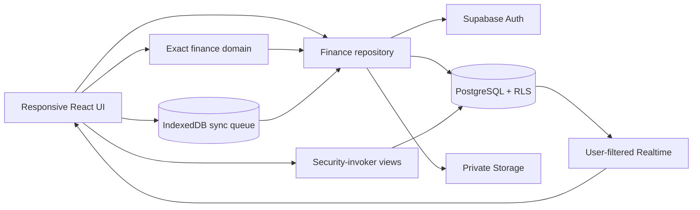

# Architecture

Expenso is a Next.js App Router PWA backed by Supabase. One authenticated identity owns one isolated personal finance environment.

## Boundaries

- `src/features/finance`: types, exact-money functions, calculations, rules, repository, and shared state.
- `src/features/imports`: file-specific importers followed by normalized records and a review queue.
- `src/lib/supabase`: browser/server clients. The service-role key is never used by product request paths.
- `src/lib/offline`: durable mutation queue. Replayed operations still use the user's normal Supabase session and therefore RLS.
- AI and AI-assisted OCR have no provider adapter in this release; reserved routes fail closed.
- `supabase/migrations`: source of truth for data, authorization, storage, database functions, and Realtime.

## Data flow

Money enters as a decimal string, is validated, and becomes integer minor units (`bigint`) in TypeScript. It is serialized back to a two-decimal string for PostgreSQL `NUMERIC(20,2)`. Charts convert already-calculated display series to JavaScript numbers; chart values never feed balances or reports.

The production repository reads and mutates Supabase. When both public Supabase values are absent, the explicit `/demo` entry loads a clearly labeled synthetic dataset and persists demo changes in local storage. A valid Supabase configuration always takes precedence over stale demo state; invalid configuration or live connection/authentication failures surface an error instead of loading samples. Demo records never enter a production database.

## Historical consistency

Dashboards, budgets, reports, and cash flow are derived from transactions. Production account balances and net worth use the RLS-scoped `account_balances` view; cached/demo mode uses the same deterministic balance rules in TypeScript. Historical edits refresh each consumer.
